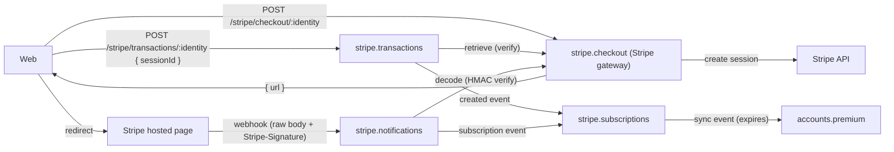
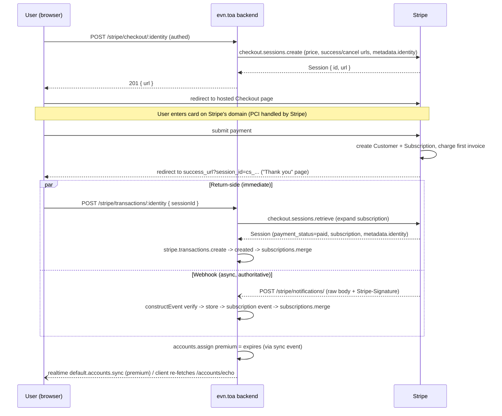
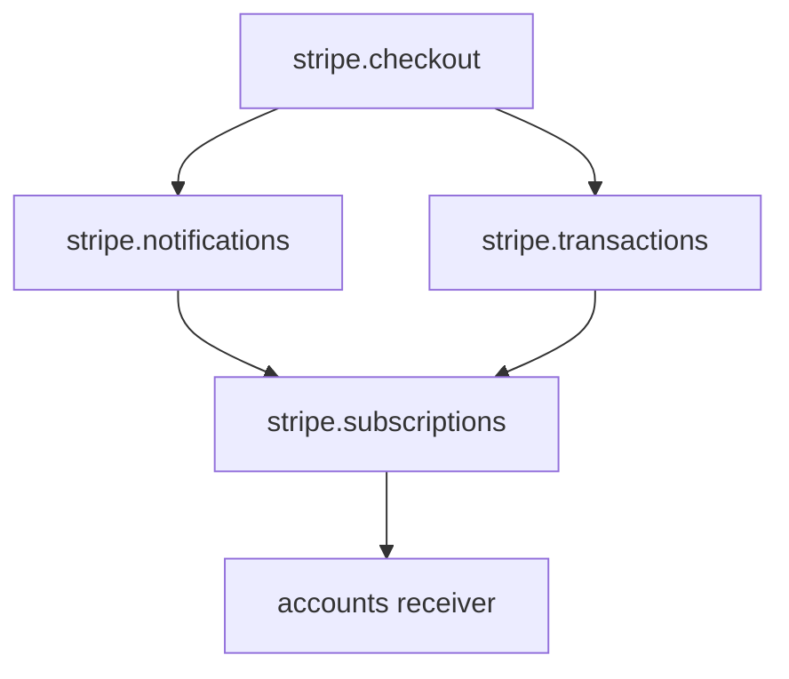

# Stripe Web Subscriptions Integration

Mirror the proven `appstore.*` design with parallel `stripe.*` components. Web client redirects to Stripe Checkout; Stripe webhooks drive `accounts.premium` through the same sync mechanism Apple uses.

## Target flow



Two channels feed `stripe.subscriptions`, mirroring the appstore design (`appstore.transactions` client-submit + `appstore.notifications` webhook):
- Return-side: after redirect the client posts the `sessionId` to `stripe.transactions` for immediate confirmation.
- Webhook: `stripe.notifications` is the async source of truth (works even if the user closes the tab; handles renewals/cancellations).

Identity mapping: pass account id as `client_reference_id` + `subscription_data.metadata.identity` when creating the session; read `metadata.identity` back from the session/subscription/webhook objects. `expires = current_period_end*1000`, `timestamp = event.created*1000`.

## Webhook authenticity: real Stripe HMAC (raw body)

Stripe signs `` `${t}.${rawBody}` `` (HMAC-SHA256, secret = endpoint signing secret) and sends it in the `Stripe-Signature` header. Verification requires the exact original bytes — re-serialized JSON will not match.

**TOA support is implemented** (see [map.feature](https://github.com/toa-io/toa/blob/0bedb613a0d96545b9ff37f1388eb9d0d43cc237/extensions/exposition/features/map.feature#L330)): the `map:buffer: <prop>` directive maps the raw request body into operation input, and `application/json; charset=utf-8` is accepted. The original [rawbody.md](rawbody.md) spec is therefore resolved.

`stripe.notifications` ingest uses `map:buffer` for the raw payload + `map:headers` for `stripe-signature`, then passes both to the `stripe.checkout.decode` operation, which calls the Stripe SDK on the client instance: `client.webhooks.constructEvent(payload, signature, webhookSecret)` (here `client.webhooks` is the SDK's webhooks namespace, unrelated to our `stripe.notifications` component).

Note: `map:buffer` delivers the body as a **UTF-8 string**, not a `Buffer` ([map.md#raw-body](https://github.com/toa-io/toa/blob/dev/extensions/exposition/documentation/map.md#raw-body)). Decode it back to bytes in the operation before verifying, e.g. `client.webhooks.constructEvent(Buffer.from(payload, 'utf-8'), signature, webhookSecret)`, so the HMAC is computed over the original bytes.

## Purchase workflow (end to end)

What happens between the user clicking "Purchase" and seeing "Thank you". The `success_url` redirect is UX only; premium is granted by verified data from either the **return-side `sessionId`** (immediate) or the **webhook** (async source of truth) — both converge on `stripe.subscriptions.merge` and are idempotent.



Step by step:

1. User clicks Purchase. Browser calls `POST /stripe/checkout/:identity` (authenticated as that identity).
2. `stripe.checkout.create` resolves the chosen `plan` to a Stripe price via config (`prices[plan]`, rejecting unknown plans) and calls Stripe `checkout.sessions.create` with `mode: subscription`, `line_items: [{ price: prices[plan], quantity: 1 }]`, `success_url` (including `?session_id={CHECKOUT_SESSION_ID}`), `cancel_url`, `client_reference_id: identity`, and `subscription_data.metadata.identity` (so the identity rides along onto the Subscription object). The Stripe **secret key stays server-side** here.
3. Backend returns `201 { url }`; browser redirects to Stripe's hosted Checkout page. Card data is entered on Stripe's domain — we never touch it.
4. On payment success Stripe creates a Customer + Subscription and redirects the browser to `success_url?session_id=cs_...` (our "Thank you" page).
5. Return-side confirmation: the Thank-you page posts the `session_id` to `POST /stripe/transactions/:identity`. `stripe.transactions.create` → `stripe.checkout.retrieve(id)` (expanding the subscription), checks `payment_status === 'paid'`, then stores and emits `created` → `stripe.subscriptions.merge`. Gives the user instant premium without waiting for the webhook.
6. Webhook (independent, authoritative): Stripe sends events to `POST /stripe/notifications/` — `customer.subscription.created` on first purchase, `invoice.paid` + `customer.subscription.updated` on renewals, `customer.subscription.deleted` on cancellation. `stripe.notifications` verifies the signature and emits the `subscription` event → `stripe.subscriptions.merge`.
7. `stripe.subscriptions.merge` reads `metadata.identity` and `current_period_end` and upserts the Subscription entity (keyed by Stripe subscription id, so the return-side and webhook paths are idempotent — whichever arrives first wins, later ones are no-ops via the timestamp guard). Its `sync` event sets `accounts.premium = expires`.
8. The Thank-you page reflects premium via the realtime `default.accounts.sync` event (or by re-fetching `GET /accounts/echo/`).

Why the redirect itself can't grant premium: it is unauthenticated and can be skipped/lost. Both real grant paths verify with Stripe — the return-side by retrieving the session via the secret key, the webhook by HMAC signature — same dual model Apple uses (`appstore.transactions` + `appstore.notifications`).

## Components (under `application/components/`)

Stripe object types below are from the `stripe` package (`import type Stripe from 'stripe'`); account `identity` is the 32-hex account id. Entities extend the framework `Entity` (`import type { Entity } from 'types'`).

### stripe.checkout

The Stripe gateway: the only component that holds Stripe credentials and the SDK, so no other component touches Stripe directly. It both exposes the public purchase-start endpoint and provides the session-retrieval and webhook-decode helpers used by `stripe.transactions` and `stripe.notifications`. Combines the public entrypoint with the credential/SDK isolation that `appstore.verifier` provides for the appstore set.

#### Operations

- `create`: begin a purchase for an account — open a hosted Checkout session at Stripe and return the URL the browser should be redirected to. (Public endpoint.)

```ts
type Input = { identity: string; plan: string }  // identity from path; plan = chosen option key
type Output = { url: string }                     // hosted Checkout URL to redirect to
// `plan` is resolved to a Stripe price id via config `prices` (reject unknown plans); urls come from config
```

- `retrieve`: read a Checkout session back from Stripe's API (authoritative) to learn whether it was paid and which account/subscription it belongs to. (Used by `stripe.transactions`.)

```ts
type Input = { sessionId: string }            // cs_...
type Output = Stripe.Checkout.Session          // with expanded `subscription`
```

- `decode`: validate a pushed webhook's Stripe signature and return its decoded event; verification is intrinsic to decoding and rejects forgeries. (Used by `stripe.notifications`.)

```ts
type Input = { payload: string; signature: string }  // raw body (utf-8) + Stripe-Signature
type Output = Stripe.Event                            // throws/returns Error on bad signature
```

#### Events

None.

#### State

None (stateless; holds only configuration. Identity is round-tripped through Stripe via `client_reference_id` / `metadata`).

### stripe.transactions

Accepts the client's proof of payment when it returns from Stripe and confirms it by reading the session back from Stripe's API, giving the user immediate confirmation. Mirrors [appstore.transactions](application/components/appstore.transactions/manifest.toa.yaml).

#### Operations

- `create`: confirm a checkout session submitted by the returning client (verify it is paid and belongs to this account) and record it as a confirmed purchase.

```ts
type Input = { identity: string; sessionId: string }  // identity from path, sessionId from body
type Output = Transaction                              // stored entity; HTTP exposes `id`
```

#### Events

- `created`: a purchase was confirmed from the client's return. Consumed by `stripe.subscriptions`.

#### State

```ts
interface Transaction extends Entity {
  identity: string            // account id (32-hex)
  session: Stripe.Checkout.Session  // the verified, paid checkout session
}
```

### stripe.notifications

Receives and authenticates Stripe's asynchronous subscription lifecycle notifications and records them — the reliable source of truth, independent of the browser. Mirrors [appstore.notifications](application/components/appstore.notifications/manifest.toa.yaml).

#### Operations

- `ingest`: authenticate an incoming Stripe webhook and persist the subscription lifecycle event it reports (append-only audit log, mirroring `appstore.notifications`; idempotency is enforced downstream by `stripe.subscriptions.merge`'s timestamp guard, not here).

```ts
type Input = { payload: string; signature: string }  // map:buffer body + map:headers signature
type Output = Event                                   // stored entity
```

#### Events

- `subscription`: a subscription was created, renewed, or cancelled at Stripe. Consumed by `stripe.subscriptions`.

#### State

```ts
interface Event extends Entity {
  id: string                       // Stripe event id (evt_...)
  type: string                     // e.g. 'customer.subscription.updated'
  created: number                  // Stripe event timestamp (seconds)
  subscription?: Stripe.Subscription  // data.object for subscription.* events
}
```

### stripe.subscriptions

Maintains the authoritative subscription expiration per account, reconciling signals from both the return-side and webhook channels. Mirrors [appstore.subscriptions](application/components/appstore.subscriptions/manifest.toa.yaml).

#### Operations

- `merge`: update an account's subscription expiration from a purchase or lifecycle signal, ignoring stale/duplicate ones (timestamp guard makes the two channels idempotent). Keyed by the Stripe subscription id; both receivers (`stripe.transactions.created`, `stripe.notifications.subscription`) normalize their payload into `MergeInput`.

```ts
type MergeInput = {
  subscription: Stripe.Subscription  // carries id, metadata.identity, items[].current_period_end, status
  timestamp: number                  // signal time in ms (event.created*1000, or session/now)
}
type MergeOutput = void              // transition mutates the Subscription entity; framework persists
```

#### Events

- `sync`: an account's subscription expiration changed. Consumed by `accounts` to set `premium`.

#### State

```ts
interface Subscription extends Entity {
  id: string        // Stripe subscription id (sub_...)
  identity: string  // account id (32-hex)
  expires: number   // premium expiration in ms (current_period_end * 1000)
  timestamp: number // time of the last applied signal in ms (obsolete guard)
}
```

## Wiring (existing files)

- [accounts/manifest.toa.yaml](application/components/accounts/manifest.toa.yaml): add receiver `stripe.subscriptions.sync: assign` (next to existing `appstore.subscriptions.sync: assign`). Reuses [appstore.subscriptions.sync.js](application/components/accounts/receivers/appstore.subscriptions.sync.js) logic in a new `stripe.subscriptions.sync.js` mapping `expires -> premium`.
- [context/compositions.yaml](application/context/compositions.yaml): add a `stripe` composition listing the four `stripe.*` components (`stripe.checkout`, `stripe.transactions`, `stripe.notifications`, `stripe.subscriptions`).
- [context/configuration.yaml](application/context/configuration.yaml): add `stripe.checkout` config (`secretKey: $STRIPE_SECRET_KEY`, `webhookSecret: $STRIPE_WEBHOOK_SECRET`, `prices` — a map of plan key → Stripe price id, e.g. `{ monthly: price_..., yearly: price_... }`, `successUrl`, `cancelUrl`); add `$STRIPE_SECRET_KEY` and `$STRIPE_WEBHOOK_SECRET` to env.

## Testing (features)

Feature tests must be hermetic — no network, deterministic, no secrets — so they cannot hit Stripe's real API. We use the same trick as appstore: `stripe.checkout` (the gateway) has an env-gated **stub** in place of the SDK, analogous to `createPlainVerifier` in [verifier.js](application/components/appstore.notifications/operations/lib/verifier.js) which returns the `plainPayload` as-is when `context.env === 'local'`.

Stub behavior (gateway in local/test, no Stripe calls):

- `create` → returns a deterministic fake `{ url }` (e.g. `https://checkout.stripe.test/<id>`), no API call.
- `decode(payload, signature)` → `JSON.parse(payload)` and return it as the event, skipping HMAC (just like the appstore plain verifier treats the signed input as already-decoded).
- `retrieve(sessionId)` → returns the session supplied inline by the test instead of fetching it: in local the `sessionId` carries the session JSON (the analog of appstore's `plainPayload`), so the test fully controls `payment_status`, `metadata.identity`, and `current_period_end`.

`features/resources/stripe.feature`, mirroring [appstore.feature](features/resources/appstore.feature) (which posts a `plainPayload` notification and asserts the realtime `default.accounts.sync` carries `premium`):

- Checkout: `POST /stripe/checkout/:identity { plan }` returns `201` with a stub `url`; an unknown `plan` is rejected.
- Notification path: `POST /stripe/notifications/` with a JSON `customer.subscription.created` body carrying `metadata.identity` + `current_period_end`; assert `GET /accounts/echo/` then shows `premium` and the realtime `default.accounts.sync` event is received by the account.
- Return-side path: `POST /stripe/transactions/:identity { sessionId }` (stub returns a paid session) grants the same `premium`.
- Idempotency: applying both channels for the same subscription does not double-apply or regress (timestamp guard).

Why not Stripe test mode here: real test-mode/sandbox calls add network, flakiness, and credentials, breaking hermetic CI. Test mode is for manual end-to-end on localhost — see the next chapter.

## Out of scope (per "simplest")

No Stripe Customer Portal, no proration/upgrade flows, no restore endpoint. Renew/cancel handled only via the webhook events listed above.

## Client implementation (manual testing on localhost)

How a client developer exercises the real API against Stripe **test mode** on localhost. The gateway stub is bypassed when a real Stripe key is configured (gate the stub on absence of `secretKey`, not purely on env), so providing `sk_test_...` makes the gateway call real Stripe even locally.

Setup steps:

1. Create a Stripe account; keep the dashboard in **Test mode**.
2. Dashboard → Product catalog → add a Product with one **recurring Price** per plan option (e.g. monthly, yearly); copy each price id `price_...`.
3. Dashboard → Developers → API keys → copy the **test secret key** `sk_test_...` (hosted Checkout needs no publishable key).
4. Install the [Stripe CLI](https://docs.stripe.com/stripe-cli), run `stripe login`, then forward events to the local notifications endpoint:

```bash
stripe listen --forward-to localhost:8000/stripe/notifications/
```

The CLI prints a webhook signing secret `whsec_...` — copy it.

5. Configure local env / `stripe.checkout` config:
   - `STRIPE_SECRET_KEY=sk_test_...`
   - `STRIPE_WEBHOOK_SECRET=whsec_...` (the value from `stripe listen`)
   - `prices` map, e.g. `{ monthly: price_..., yearly: price_... }`
   - `successUrl=http://localhost:<web>/thanks?session_id={CHECKOUT_SESSION_ID}`, `cancelUrl=http://localhost:<web>/cancel`
6. Start the app (the `stripe` composition) and keep `stripe listen` running.

Exercising the flow:

1. Client calls `POST /stripe/checkout/:identity` (authed) with the chosen `{ plan }` → receives a real test Checkout `url`.
2. Open the `url`, pay with a Stripe test card (`4242 4242 4242 4242`, any future expiry, any CVC/ZIP).
3. Stripe redirects to `successUrl?session_id=cs_test_...`; the Thank-you page posts that `session_id` to `POST /stripe/transactions/:identity` (immediate grant).
4. In parallel, `stripe listen` forwards `customer.subscription.created` (and later renewals/cancellations) to `/stripe/notifications/` (authoritative grant).
5. Verify with `GET /accounts/echo/` → `premium` is set.

Useful: replay/trigger events without paying, e.g. `stripe trigger customer.subscription.updated`. Cancellations/renewals can be simulated from the dashboard or CLI and arrive via `/stripe/notifications/`.

## Incremental implementation stages

One component per stage (accounts wiring rides with the stage that first needs `premium`). Dependency order: gateway → subscription state → webhook ingress → return-side ingress → cross-channel idempotency.



Add scenarios to `features/resources/stripe.feature` incrementally (same file, `@local`, mirroring [appstore.feature](features/resources/appstore.feature)). Each stage: write scenarios first (they may fail until implementation), then implement until green.

---

### Stage 1 — `stripe.checkout`

Gateway only; no premium yet.

#### 1. Features (scenarios)

- **Checkout returns a redirect URL**: authed `POST /stripe/checkout/:identity { plan }` → `201` with stub `url`.
- **Unknown plan is rejected**: same endpoint with an unconfigured `plan` → error (no session created).

#### 2. Implementation

- `application/components/stripe.checkout/`: manifest, `package.json` (`stripe` dependency), config schema (`secretKey`, `webhookSecret`, `prices`, `successUrl`, `cancelUrl`).
- Operations: `create` (resolve `prices[plan]`, `checkout.sessions.create` metadata); stub all three ops when no `secretKey` (see Testing): `create` → fake `{ url }`, `retrieve` / `decode` → minimal passthrough for later stages.
- Exposition: `POST /stripe/checkout/:identity`.
- Context: `stripe` composition entry with `stripe.checkout` only; `stripe.checkout` config + `$STRIPE_SECRET_KEY` / `$STRIPE_WEBHOOK_SECRET` placeholders in [configuration.yaml](application/context/configuration.yaml).

---

### Stage 2 — `stripe.subscriptions` (+ `accounts` sync)

State + merge + premium projection; ingress components not wired yet.

#### 1. Features (scenarios)

- **Webhook grants premium** (red until Stage 3): `POST /stripe/notifications/` with stub JSON `customer.subscription.created` (`metadata.identity`, `current_period_end`); assert `GET /accounts/echo/` shows `premium` and realtime `default.accounts.sync` for the account.

#### 2. Implementation

- `application/components/stripe.subscriptions/`: entity (`id`, `identity`, `expires`, `timestamp`), `merge` transition (timestamp guard, `expires = current_period_end * 1000`), emit `sync`.
- Receiver declaration only (handler files in later stages): `stripe.notifications.subscription: merge`, `stripe.transactions.created: merge`.
- [accounts/manifest.toa.yaml](application/components/accounts/manifest.toa.yaml): `stripe.subscriptions.sync: assign`; [stripe.subscriptions.sync.js](application/components/accounts/receivers/stripe.subscriptions.sync.js) (`expires` → `premium`), same pattern as [appstore.subscriptions.sync.js](application/components/accounts/receivers/appstore.subscriptions.sync.js).
- Add `stripe.subscriptions` to the `stripe` composition.

---

### Stage 3 — `stripe.notifications`

Async, authoritative channel; turns Stage 2 webhook scenario green.

#### 1. Features (scenarios)

- *(No new scenarios — re-run Stage 2 webhook scenario.)*

#### 2. Implementation

- `application/components/stripe.notifications/`: entity (`id`, `type`, `created`, `subscription`), `ingest` (anonymous).
- Exposition: `POST /stripe/notifications/` with `map:buffer` payload + `map:headers` `stripe-signature` → `stripe.checkout.decode` → persist → emit `subscription` for `customer.subscription.created` / `updated` / `deleted` (normalize to `MergeInput`).
- Receiver: `stripe.notifications.subscription.js` → `stripe.subscriptions.merge`.
- Add `stripe.notifications` to the `stripe` composition.

---

### Stage 4 — `stripe.transactions`

Return-side immediate confirmation.

#### 1. Features (scenarios)

- **Return-side grants premium**: `POST /stripe/transactions/:identity { sessionId }` where stub `retrieve` returns a paid session (inline JSON in `sessionId`, same trick as appstore `plainPayload`) → `premium` on echo + realtime sync.

#### 2. Implementation

- `application/components/stripe.transactions/`: entity (`identity`, `session`), `create` → `stripe.checkout.retrieve` → verify `payment_status === 'paid'` and identity match → store → emit `created`.
- Exposition: `POST /stripe/transactions/:identity`.
- Receiver: `stripe.transactions.created.js` → `stripe.subscriptions.merge` (map session subscription + timestamp).
- Add `stripe.transactions` to the `stripe` composition.

---

### Stage 5 — Idempotency (both channels)

No new component; exercises merge guard across ingress paths.

#### 1. Features (scenarios)

- **Dual channel is idempotent**: for one Stripe subscription id, post notification then transaction (either order); `premium` reflects the latest `current_period_end`; second signal does not regress or double-apply.

#### 2. Implementation

- Confirm `merge` timestamp guard and shared subscription key (`sub_...`) handle out-of-order delivery; adjust receivers only if normalization differs between channels.
- Full `stripe` composition (all four components) and config review.

---

### After all stages

Manual end-to-end with Stripe test mode + CLI ([Client implementation](#client-implementation-manual-testing-on-localhost)); no change to hermetic CI.
