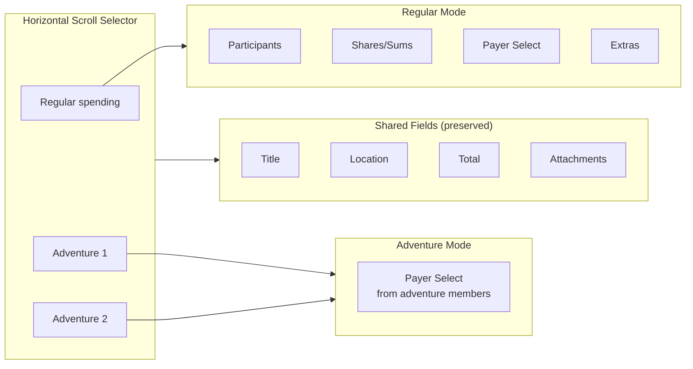
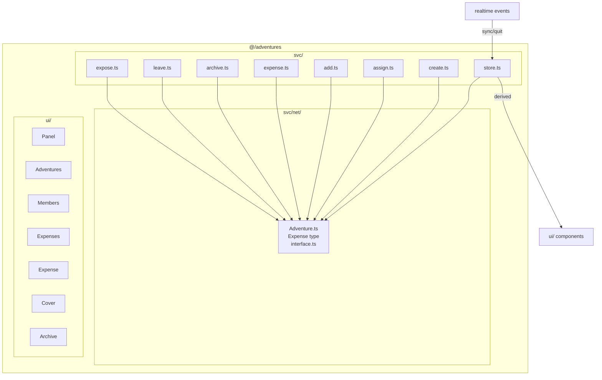
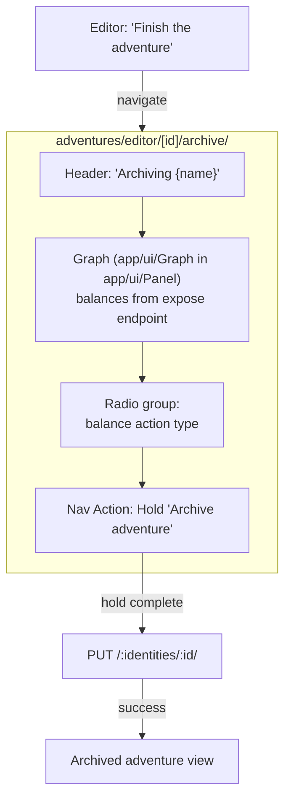
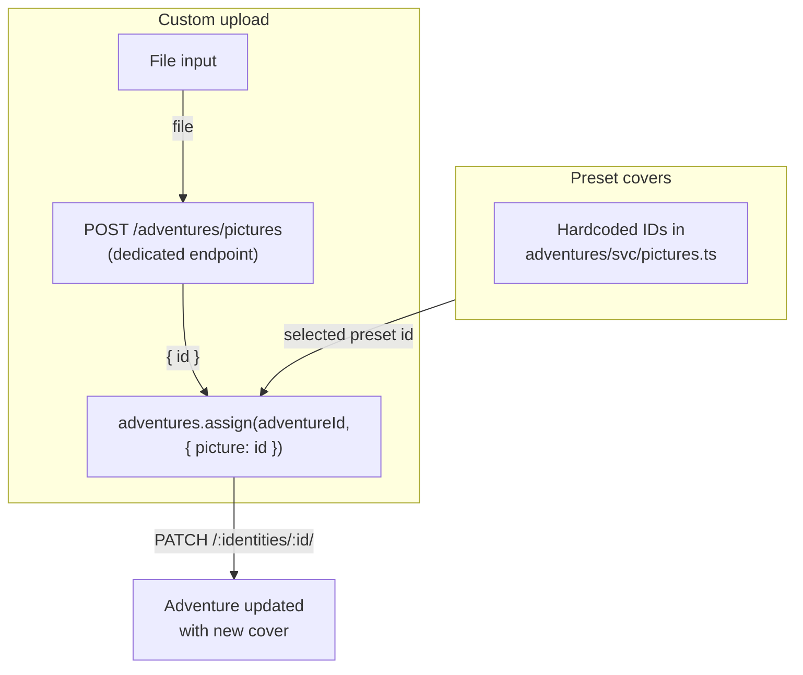

# Adventures Feature Design

## Navigation Flow

```mermaid
flowchart TD
    EXP["/expenses/"] -->|tap adventure card| VIEW["/adventures/[id]/"]
    EXP -->|tap "+ Create"| EDIT_NEW["/adventures/editor/"]
    VIEW -->|Settings icon| EDIT["/adventures/editor/[id]/"]
    VIEW -->|Plus action| EXPENSE_ED["/expenses/editor/\n(adventure preselected)"]
    EDIT -->|Add members| ADD["/adventures/editor/[id]/add/"]
    EDIT -->|Finish the adventure| ARCHIVE["/adventures/editor/[id]/archive/"]
    ADD -->|back| EDIT
    ARCHIVE -->|Hold archive| VIEW_ARCH["archived adventure view"]
    MAIN["/ (main dropdown)"] -->|"+ [Title]"| EXPENSE_ED
```

## Expense Editor Context Switch



## Domain Architecture



## Archive Screen Flow



## Domain `@/adventures`

### Network Types (`svc/net/Adventure.ts`)

```typescript
interface Adventure {
  id: string
  participants: Record<string, number>
  title: string
  picture: string
  expenses: Expense[]
  archived: boolean
  archivedAt: number | null
  archivator?: string
}

interface Invitation {
  id: string
  title: string
  picture: string
  identities: string[]
}

interface Expense {
  id: string
  title: string
  location?: string
  date: string
  amount: number
  payer: string
  attachments: string[]
}
```

`identities` exists on backend entity and invitation `GET`, but not in CRUD exposition `io:output`. For screens working with regular adventure payloads, derive member ids from `Object.keys(participants)`.

### No Linked Entity

Accounts needed only in UI for rendering avatars/names. Store holds raw CRUD `net.Adventure`. Components derive member ids from `participants`, then fetch accounts via `accounts.get(identity)` at render time.

If computed fields needed later (e.g. `totalSpent`), extend in `svc/Adventure.ts`. YAGNI for now.

### Store

`collection` + `derived` (like expenses/groups). Realtime:
- `default.adventures.sync` — participant changes
- `default.adventures.quit` — participant left

### Services

| Function | Backend Operation | Method |
|----------|------------------|--------|
| `create` | `create` | POST `/:identities/` |
| `assign` | `assign` (title/picture) | PATCH `/:identities/:id/` |
| `add` | `add` (participants) | POST `/:identities/:id/` |
| `expense` | `add` (expenses) | POST `/:identities/:id/` |
| `archive` | `archive` | PUT `/:identities/:id/` |
| `leave` | `leave` | DELETE `/:identities/:id/` |
| `expose` | `expose` (contacts graph) | GET `/:identities/:id/contacts/` |
| `enumerate` | `enumerate` | GET `/:identities/` |

## Routes

| Route | Purpose |
|-------|---------|
| `adventures/[id=id]/` | View adventure |
| `adventures/editor/[[id=id]]/` | Create/edit adventure |
| `adventures/editor/[[id=id]]/add/` | Add members |
| `adventures/editor/[id=id]/archive/` | Archive screen |

## UI Components (`@/adventures/ui/`)

- `Panel.svelte` — card in horizontal scroll (cover background, title)
- `Adventures.svelte` — horizontal scroll section: `[Active...] [+ Create] [Archived...]`
- `Members.svelte` — member list (Panel + avatar + name + balance)
- `Expenses.svelte` — adventure expense list
- `Expense.svelte` — single expense
- `Cover.svelte` — cover picker (horizontal scroll of presets + upload)
- `Archive.svelte` — "Finish the adventure" section link to archive screen

## Screens

### View Active Adventure (`adventures/[id=id]/`)

- Header: Title + `<Settings>` action → editor
- Cover image below header
- Cards: Your spending / Total spent
- Members with balances
- Expenses list
- Actions: `<Plus/>` → create expense with preselected adventure

### View Archived Adventure

- Header: Title (no actions)
- Cover image with overlay text: "Archived {date}" (Intl.RelativeTimeFormat if <2 days)
- Same as active, without Actions

### Edit Adventure (`adventures/editor/[[id=id]]/`)

- Title input + label (Cosmetics)
- Cover picker
- Members + "Add members" button → `./add/`
- "Finish the adventure" section (existing only) — link to archive screen
- Actions: `<CircleCheck/>` submit

### Add Members (`adventures/editor/add/`)

Like expenses participants page — contact list with selection.

### Archive Adventure (`adventures/editor/[id=id]/archive/`)

**Has expenses** (archive mode):
- Header: "Archiving {name}"
- Graph (from `expose` endpoint, inside `@/app/ui/Panel`)
- Radio group: balance action type on archive (e.g. transfer to regular debts / discard)
- Nav Action: Hold button "Archive adventure"

**No expenses** (delete mode):
- Header: "Deleting {name}"
- Description: "This adventure has no expenses and will be deleted"
- Nav Action: Hold button "Delete adventure"
- Backend soft-deletes (`_deleted`), removed from listings

## Expense Editor Modification

### Context & Value Changes

Current types:

```typescript
interface Context {
  value: Value
  mode: 'sums' | 'shares'
  snapshot: string
}

interface Value {
  title: string
  location?: string
  participants: Record<string, Participant>
  extras: Extra[]
  attachments: string[]
}
```

Updated types:

```typescript
interface Context {
  value: Value
  mode: 'sums' | 'shares'
  snapshot: string
  adventure?: string          // adventure id — undefined = regular expense
}

// Value stays the same — no structural changes.
// In adventure mode, `participants` and `extras` are unused (empty).
// Shared fields: title, location, attachments.
// `amount` lives in Form Context (computed from participants in regular,
// direct input in adventure mode).
```

**Switching behavior:** selecting an adventure sets `ctx.adventure = id` and resets `ctx.value.participants = {}`, `ctx.value.extras = []`. Switching back to Regular resets adventure fields — no restoration of previous state.

**Payer:** in adventure mode, payer is selected from `adventure.identities` (any participant). Payer is part of Value (`value.payer?: string`) — set by adventure payer select, read at submit time. Unused in regular mode.

### Adventure Selector

Horizontal scroll above form: `[Regular spending] [Adventure1] [Adventure2]...`
- Shown only if >=1 active adventure exists
- Uses `<Panel selectable>` with cover background (like Favorites)
- Switching preserves shared fields (title, location, total, attachments)
- Switching resets non-shared fields (participants, extras) — no state restoration

### Adaptive Lower Section

- **Regular** — Participants (shares/sums), Payer select, Extras
- **Adventure** — Payer select only (from adventure participants)

### Connector

`Edit.svelte`: if `ctx.adventure` set → calls `adventures.expense(adventureId, { title, amount, payer, location?, date?, attachments? })`, else regular expenses API. Adventure expense input is a subset of regular — no participants/shares/extras.

## Graph Refactoring

Extract D3 force simulation + SVG rendering from `@/groups/ui/Graph` into `@/contacts/ui/Graph`.

Both adventures and groups `expose` endpoints return identical `contacts.net.Contact[]` (both delegate to `contacts.expose({ identities })`). No separate type — reuse `Contact` from `@/contacts/svc/net`.

```typescript
interface Props {
  contacts: Contact[]   // contacts.net.Contact from expose endpoint
  accounts: Account[]   // pre-resolved accounts for all identities in contacts
  class?: string
}
```

Pure presentational — no service imports, no store access. Pages extract identities from `contacts`, fetch accounts via `<Async store={combined(...)}>`, pass both as props. All accounts equal — no "me" distinction in graph.

Both domains: call `domain.expose(id)` → extract identities → fetch accounts → `<Graph {contacts} {accounts} />`.

Delete `@/groups/ui/Graph` — groups page uses `@/contacts/ui/Graph` directly. Add `expose` service to `@/groups`.

## Main Dropdown

Add item in `@/app/ui/Actions`: `+ [Adventure Title]` for last active adventure.
Links to `/expenses/editor/` with preselected adventure.

## Cover Upload

### Backend

`pictures` — standalone asset storage component. Serves at `/pictures/{id}` (anonymous, 30-day cache). No adventure-specific upload endpoint exists.

### Flow



### Implementation

- **Presets**: `@/adventures/svc/pictures.ts` — array of adventure cover IDs (different from account avatar IDs)
- **Upload**: `POST /adventures/pictures` — dedicated endpoint (`adventures.pictures.post(file)`), returns `{ id }` stored in shared `pictures` storage
- **Update**: `adventures.assign(adventureId, { picture: id })` — PATCH to update adventure
- **Cover.svelte**: horizontal scroll of preset cover cards + upload button. Not reusing `Cosmetics` (different layout — horizontal picker vs avatar+name row)

## Implementation Instructions

**Always invoke `seed-svelte` skill before planning or implementing any step.** Load the relevant reference per Task Router table before writing code.

**Git discipline:** Design and plan docs are NOT committed. Implementation plan split into phases, one commit per phase. Commit only on user's explicit command after review.

## Decisions

- No notifications for adventures
- Can't open/edit adventure expenses
- Attachments shared between Regular and Adventure modes (same UI)
- Any adventure participant can be payer
- `payer` is part of Value (`value.payer?: string`), not a separate form field
- Switching Regular↔Adventure resets non-shared fields (no restoration)
- Adventures and Groups expose endpoints return same `contacts.net.Contact[]` — single Graph component, resolves accounts internally
- Archive without expenses = soft delete (`_deleted`). UI shows "Delete" flow instead of "Archive" with graph/merge
- Cover upload uses dedicated `POST /adventures/pictures` endpoint (not accounts)
